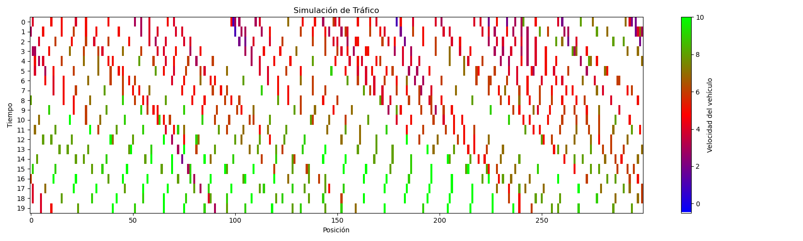

# Modelo Nagel-Schreckenberg para Simulación de Tráfico


**Versión y Actividad**

<p align="left">
  <a href="https://github.com/imarranz/nagel-schreckenberg-model/pulls">
    
  </a>
  <a href="LICENSE.md">
    
  </a>
   <a href="https://github.com/imarranz/nagel-schreckenberg-model"></a>
  </a>
</p>


<br>

**Análisis**


<br>

**Redes Sociales**

<p align="left">
  <a href="https://twitter.com/imarranz" target="_blank">
    
  </a>
</p>


Este repositorio contiene una implementación del modelo de [Nagel-Schreckenberg](https://en.wikipedia.org/wiki/Nagel%E2%80%93Schreckenberg_model) en Python para simular el tráfico vehicular en una carretera. El modelo de Nagel-Schreckenberg es un modelo de simulación que se utiliza para estudiar el comportamiento del tráfico y la congestión en carreteras.

## Descripción del Modelo

El modelo de Nagel-Schreckenberg se basa en reglas simples de interacción entre vehículos en una carretera. Incluye componentes como aceleración, desaceleración, frenado aleatorio y movimiento, que permiten simular el tráfico en una carretera de manera realista. Los vehículos avanzan y ajustan su velocidad en función de la distancia al vehículo de adelante y factores aleatorios. Los vehículos avanzan de una celda a otra en pasos discretos de tiempo, siguiendo reglas muy simples pero realistas:

  * **Aceleración**: Si la velocidad de un vehículo es menor que su velocidad máxima permitida y no hay obstáculos delante, acelera en una unidad.

  * **Desaceleración**: Si la distancia al vehículo de adelante es menor o igual a su velocidad actual, reduce su velocidad a la distancia disponible.

  * **Frenado Aleatorio: Con una probabilidad dada, un vehículo puede reducir su velocidad de manera aleatoria, simulando comportamientos humanos impredecibles.

  * **Movimiento**: Los vehículos avanzan de acuerdo a sus velocidades actualizadas.

  * **Entrada de Nuevos Vehículos**: En cada paso, se pueden agregar nuevos vehículos a la carretera, generalmente desde el extremo izquierdo.

## Uso del Código

1. Clona este repositorio en tu máquina local:

```
$ git clone https://github.com/imarranz/nagel-schreckenberg-model.git
```

2. Accede al directorio del proyecto:

```
$ cp nagel-schreckenberg-model
```


3. Ejecuta el modelo de simulación proporcionando los parámetros deseados, como longitud de la carretera, densidad de vehículos, velocidad máxima, probabilidad de desaceleración, número de pasos, etc.:

```
$ python nagel_schreckenberg_model.py
```

4. Observa la simulación en tiempo real y analiza el comportamiento del tráfico en la carretera.

## Salida

Actualmente, el código está desarrollado para que genere una imagen como la siguiente:



En esta imagen se muestran los diferentes tiempos evaluados en el eje Y (_tiempo_) mostrando en la parte superior los primeros estados y en la parte inferior los últimos estados analizados. En el eje X (_posición_) la posición de cada coche en la carreter. Cada punto representa un vehículo y el color nos dice la velocidad a la que circula cada vehículo.

## Personalización

Puedes personalizar la simulación ajustando los parámetros en el archivo `nagel_schreckenberg_model.py` según tus necesidades. Experimenta con diferentes configuraciones para observar cómo afectan al tráfico y la congestión en la carretera.

## Requisitos

Asegúrate de tener Python 3.x instalado en tu sistema. Además, puedes instalar las bibliotecas necesarias ejecutando:

```
$ pip install numpy matplotlib
```

## Contribuciones

Si deseas contribuir a este proyecto o realizar mejoras, ¡eres bienvenido! Siéntete libre de abrir un [issue](https://github.com/imarranz/nagel-schreckenberg-model/issues) o enviar una [pull request](https://github.com/imarranz/nagel-schreckenberg-model/pulls) con tus cambios.


## Licencia

Este proyecto está bajo la Licencia MIT. Consulta el archivo [LICENSE](LICENSE.md) para obtener más detalles.
